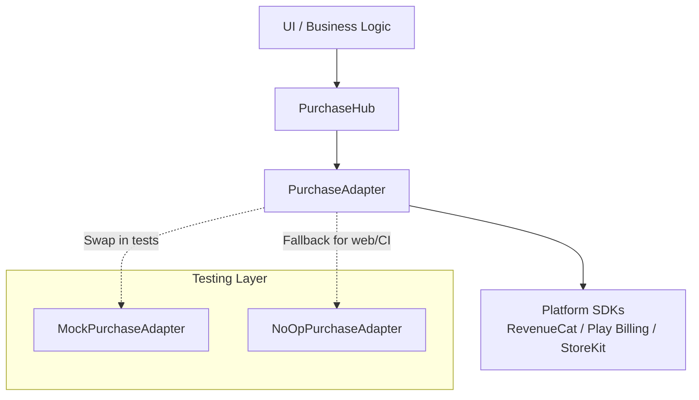

# Purchase Hub Core

A declarative, testable Dart/Flutter abstraction layer for in-app purchases and subscriptions. Provides a unified API over platform-specific billing SDKs (RevenueCat, Google Play Billing, App Store) with built-in support for offline-first flows, state restoration, and comprehensive testing via mock adapters.

## Features

- **Platform-agnostic adapter pattern** – swap implementations without changing business logic.
- **Zero-throw guarantee** – all errors are typed domain failures (`PurchaseFailure` subclasses).
- **State streaming** – real-time subscription updates via `Stream<Subscription>`.
- **Test-first design** – includes `MockPurchaseAdapter` with call recording and behavior simulation.
- **Fallback adapter** – `NoOpPurchaseAdapter` for unsupported platforms/CI environments.
- **Identity management** – associate store purchases with your own user IDs.
- **Configurable startup** – control initialization behavior and emission policies.

## Quick Start

### 1. Initialize the Hub

```dart
import 'package:purchase_hub_core/purchase_hub_core.dart';

final hub = PurchaseHub(
  initializer: YourRevenueCatInitializer(apiKey: 'your_api_key'),
  config: const PurchaseHubConfig(
    autoFetchOnInitialize: true,
    emitNoneOnStartup: true,
  ),
);

await hub.initialize();
```

### 2. Listen to Subscription State

```dart
hub.subscriptionUpdates.listen((subscription) {
  if (subscription.isActive) {
    print('User has ${subscription.productId}');
  } else {
    print('No active subscription');
  }
});
```

### 3. Make a Purchase

```dart
try {
  final result = await hub.purchase('pro_annual');
  print('Purchased: ${result.subscription.productId}');
} on PurchaseCancelledFailure {
  print('User cancelled the purchase flow');
} on AlreadySubscribedFailure {
  print('User already owns this subscription');
} on PurchaseFailure catch (e) {
  print('Purchase failed: $e');
}
```

### 4. Restore Purchases (iOS requirement)

```dart
try {
  final restored = await hub.restorePurchases();
  print('Restored: ${restored.productId}');
} on NoPurchasesToRestoreFailure {
  print('No previous purchases found');
}
```

### 5. Associate with Your User System

```dart
await hub.setUserId('auth0|12345'); // after your auth succeeds
```

## Testing with MockPurchaseAdapter

The mock adapter lets you simulate store behavior deterministically:

```dart
final mockAdapter = MockPurchaseAdapter.activeSubscription(
  productId: 'premium_monthly',
  period: SubscriptionPeriod.monthly,
);

// Or start from a clean state:
final mockAdapter = MockPurchaseAdapter.readyToPurchase();

// Inject into hub (you may need to adapt your DI setup)
final hub = PurchaseHub(
  initializer: () => mockAdapter, // implement a test initializer
);

// Simulate an external event (e.g. webhook)
mockAdapter.simulateExternalSubscriptionChange(
  Subscription(
    productId: 'premium_annual',
    status: SubscriptionStatus.active,
    scope: SubscriptionScope.premium,
    period: SubscriptionPeriod.annual,
    willRenew: true,
    isTrial: false,
    expiresAt: DateTime.now().add(const Duration(days: 365)),
  ),
);

// Configure behavior for next purchase
mockAdapter.purchaseBehavior = MockPurchaseBehavior.cancel;
```

**Inspect calls made during tests:**

```dart
print(mockAdapter.recordedCalls);
// [RecordedCall(initialize), RecordedCall(purchase, argument: pro_monthly)]

print(mockAdapter.purchaseCallCount); // 1
print(mockAdapter.currentUserId); // null until setUserId is called
```

## Configuration

`PurchaseHubConfig` controls startup behavior:

```dart
const config = PurchaseHubConfig(
  offeringId: 'default',        // store offering to load
  autoFetchOnInitialize: true,  // fetch subscription state on init
  emitNoneOnStartup: true,      // emit Subscription.none if no subscription
);
```

- **`autoFetchOnInitialize`** – When `true`, `initialize()` fetches the current subscription and emits it immediately. Set to `false` if you want to control when the first fetch occurs.
- **`emitNoneOnStartup`** – When `true` and no subscription is found, emits `Subscription.none` immediately. Prevents indefinite loading states in the UI.
- **`offeringId`** – Advanced: selects a specific offering from your remote config (supported by RevenueCat).

## Architecture Overview



### Key Components

| Component | Responsibility |
|-----------|----------------|
| `PurchaseHub` | Facade that manages adapter lifecycle, merges streams, enforces config policies. |
| `PurchaseAdapter` | Interface to platform billing SDKs. Must throw only `PurchaseFailure` subclasses. |
| `MockPurchaseAdapter` | In-memory adapter for tests. Records all calls, allows runtime behavior changes. |
| `NoOpPurchaseAdapter` | Silent success adapter for unsupported platforms (web, desktop CI). |
| `Subscription` | Immutable snapshot of the current entitlement state. Includes `status`, `expiresAt`, `scope`, and `entitlements`. |
| `PurchaseFailure` | Sealed hierarchy of typed errors. Pattern-match in UI to show appropriate messages. |

## Important Notes

### Subscription State
- `Subscription.none` represents the absence of an active subscription.
- `subscriptionUpdates` **always** emits at least once after `initialize()` (either the current subscription or `Subscription.none` if `emitNoneOnStartup` is true).
- The stream never closes until `dispose()` is called.

### Identity
Call `setUserId()` after your app's authentication succeeds. This links store purchases to your user record. Pass `null` on logout.

### Idempotency
`initialize()` and `setUserId()` are idempotent – safe to call multiple times.

---

## Extending for New Platforms

To add a new billing SDK:

1. Implement `PurchaseAdapter`:
   - Map SDK callbacks to `_controller.add(subscription)`.
   - Convert all errors to appropriate `PurchaseFailure` subtypes.
   - Respect `setUserId` for account linking.

2. Create a `PurchaseInitializer` that returns your adapter.

3. Inject into `PurchaseHub` via DI.

## License

MIT
